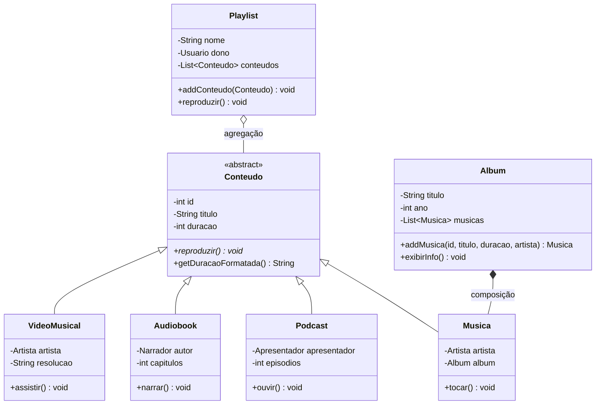
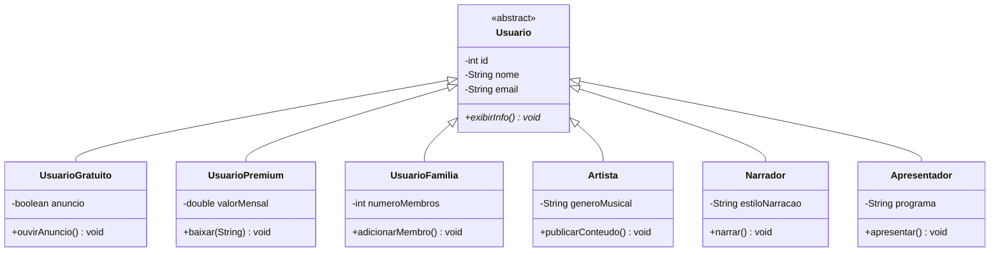
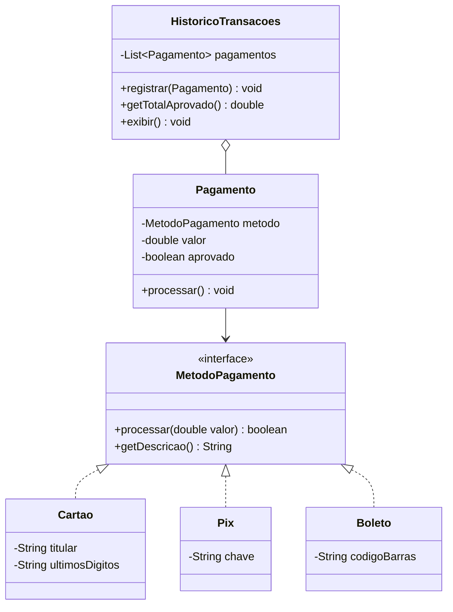
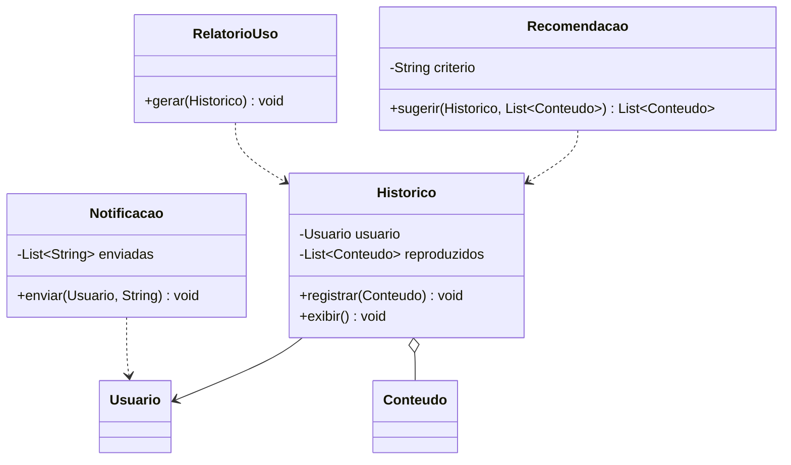

# 🎧 Aplicativo de Streaming: POO em Java

Sistema de streaming de áudio e vídeo desenvolvido em **Java puro**, aplicando os pilares da **Programação Orientada a Objetos**.

Atividade da disciplina de **Programação Orientada a Objetos** (Sistemas de Informação, Uninove). O ponto de partida foi um conjunto de diagramas UML fornecidos pelo professor; o desafio era transformar esse modelo em código funcional, respeitando herança, polimorfismo, encapsulamento, composição e agregação.

## ✨ Funcionalidades

- Usuários **Gratuito, Premium e Família**, além de **Artista, Narrador e Apresentador**
- Conteúdos: **Música, Podcast, Audiobook e Vídeo Musical**
- **Álbuns** com faixas e **playlists** que misturam qualquer tipo de conteúdo
- **Pagamentos** via Cartão, PIX e Boleto, com histórico de transações
- **Histórico** do que cada usuário reproduziu
- **Recomendações** de conteúdos ainda não ouvidos
- **Notificações** para o usuário
- **Relatório de uso**, com tempo total e quantidade por tipo de conteúdo

## 🧠 Conceitos de POO aplicados

| Conceito | Onde aparece |
|---|---|
| **Herança** | `Musica`, `Podcast`, `Audiobook` e `VideoMusical` estendem `Conteudo`; os tipos de usuário estendem `Usuario` |
| **Classe abstrata** | `Conteudo` e `Usuario` não podem ser instanciadas diretamente |
| **Polimorfismo** | `reproduzir()` é abstrato em `Conteudo`, e cada tipo implementa do seu jeito. A `Playlist` reproduz tudo sem saber o tipo de cada item |
| **Interface** | `MetodoPagamento`, implementada por `Cartao`, `Pix` e `Boleto` |
| **Encapsulamento** | Todos os atributos são `private`, com getters e setters apenas onde faz sentido. Listas são devolvidas como cópias imutáveis (`List.copyOf`) |
| **Composição** | O `Album` **cria** as próprias músicas em `addMusica()`: a faixa nasce dentro do álbum |
| **Agregação** | A `Playlist` **recebe** conteúdos que já existem, sem ser dona deles |

## 🗂️ Estrutura

```
src/
├── Main.java               → demonstração de todas as funcionalidades
├── model/
│   ├── conteudo/           → Conteudo, Musica, Podcast, Audiobook, VideoMusical, Album, Genero
│   ├── usuario/            → Usuario e seus tipos
│   └── interacao/          → Playlist, Historico, Avaliacao, Comentario
├── pagamento/              → Pagamento, Assinatura, HistoricoTransacoes
│   └── metodo/             → MetodoPagamento, Cartao, Pix, Boleto
└── servico/                → Recomendacao, Notificacao, RelatorioUso
```

## 📐 Diagramas de classes

Baseados nos diagramas UML fornecidos na atividade, já com o que foi implementado além deles.

### Conteúdos



### Usuários



### Pagamentos



### Histórico e serviços



### ➕ Além do diagrama

O enunciado pedia alguns itens que não estavam desenhados no UML, e eles foram implementados:

- **`VideoMusical`**, como mais um tipo de conteúdo
- **Métodos de pagamento** (Cartão, PIX e Boleto) com a interface `MetodoPagamento`
- **Histórico de transações**, **notificações** e **relatório de uso**

## ▶️ Como rodar

Requer **Java 17+**.

Pelo IntelliJ: abra o projeto e execute a classe `Main`.

Pelo terminal, na raiz do projeto:

```bash
javac -d out $(find src -name "*.java")
java -cp out Main
```

### Exemplo de saída

```
--- Playlist ---
Playlist 'Minhas favoritas' de perola (4 itens)
Tocando música: Noid - Slipknot (Álbum: CHROMAKOPIA) [3:24]
Ouvindo podcast: o poder so habito (Episódio #5) com clay [58:00]
Ouvindo audiobook: harry potter, narrado por bruno formiga (8 capítulos) [4:20:00]
Assistindo vídeo: Duality - Slipknot (1080p) [4:14]

--- Pagamentos e Assinaturas ---
Histórico de transações:
  - Cartão final 1234 | R$ 11.90 | aprovado
  - PIX (perola@email.com) | R$ 11.90 | aprovado
  - Boleto 34191.79001 01043.510047 | R$ 29.90 | aprovado
Total aprovado: R$ 53.70
```

## 🚀 Próximos passos

- [ ] Menu interativo com `Scanner`
- [ ] Testes unitários com JUnit

## 👤 Autor

**Samuel Oliveira**, estudante de Sistemas de Informação (Uninove)
[GitHub](https://github.com/samueloliveirz) · [LinkedIn](https://www.linkedin.com/in/samuel-oliveira-20499a252/)
